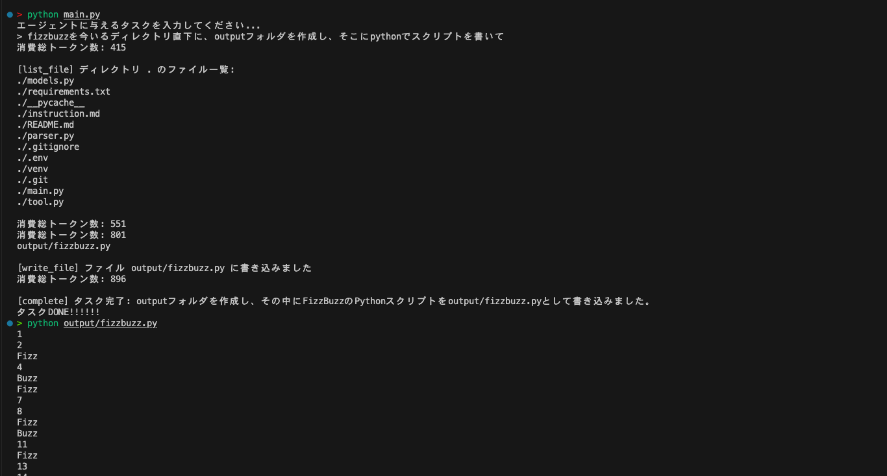

# demo-self-make-agent
- Agent demo

## 目的
- Cline や Devin のようなコーディングエージェントを自作してみる

## 構成
1. ユーザーが質問
2. LLMの応答はすべてXML形式にする
3. XMLをパース
4. XMLでツールを定義する
5. ツールをプログラムとして実装
6. LLMがComplete（ツールで定義）するまでループ

## 参考
- cline repo 
https://github.com/cline/cline
- zenn 
https://zenn.dev/minedia/articles/11822c2b509a79